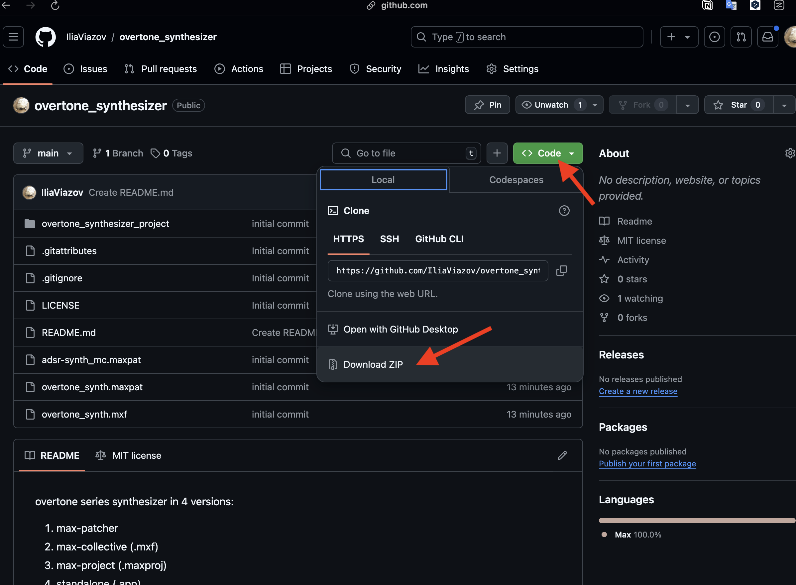
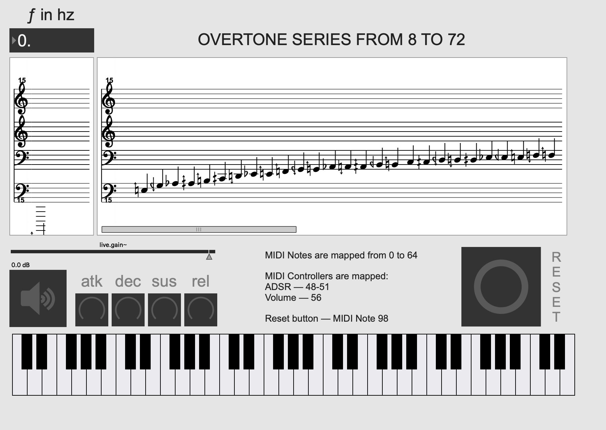

I've maid a version of overtone synthesizer from previous lesson, which you can download and play along with it.
Here is the link to the [repo of the synthesizer](https://github.com/IliaViazov/overtone_synthesizer).
To download the files — choose green button "Code" and then "Download Zip".

In the archive are few versions of it:
    1. max patch and a core of the synthesizer (.maxpat)
    2. max project (.maxproj)
    3. max collective (.mxf)
    4. and a standalone application (.app) for those who don't have a max license (unfortunately, .app format can be read only by MacOS)

You can use your own midi controller (midi mappings are written in the patch). If you don't have a controller, you can use visual keyboard in the program (it can be glitchy sometimes, if so — use reset button)
In the number box in the left corner you can type fundamental pitch in Hz, the program will generate the overtone series from 8 to 72 overtone (the range is so because scale-pattern starts from 8 overtone)
In the left score window — fundamental pitch, in the right — approximately notated overtone series.
A bit lower — volume control and turning on of the sound processes (a button with the loudspeaker — don't forget to press it to play)
The synthesizer has an ADSR envelope, so you can experement with different types of the articulation.

